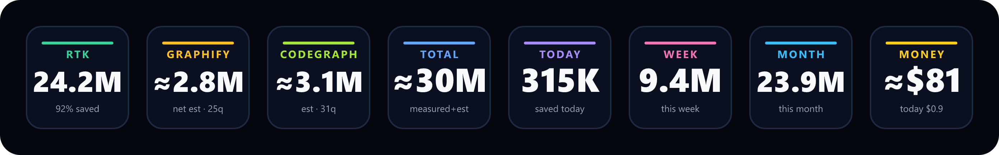

# Token Savings — Stream Deck plugin

A single Stream Deck key that shows how many AI-coding tokens you've saved with
[**RTK** (Rust Token Killer)](https://www.rtk-ai.app/), [**Graphify**](https://graphify.net/), and
[**CodeGraph**](https://www.npmjs.com/package/@colbymchenry/codegraph) —
plus today / this week / this month and the dollar value. Tap to cycle the readouts, or pin a key to one.




---

## Contents

- [What it shows](#what-it-shows)
- [How the numbers work (read this)](#how-the-numbers-work-read-this)
- [Requirements](#requirements)
- [Install](#install)
  - [A. Prebuilt (recommended)](#a-prebuilt-recommended)
  - [B. Build from source (any OS)](#b-build-from-source-any-os)
  - [Plugin folder locations](#plugin-folder-locations)
- [Configure](#configure)
- [Make the Graphify number real](#make-the-graphify-number-real)
- [Make the CodeGraph number real](#make-the-codegraph-number-real)
- [Modes & layout](#modes--layout)
- [Troubleshooting](#troubleshooting)
- [Development](#development)
- [Cutting a release](#cutting-a-release)
- [Project structure](#project-structure)
- [License](#license)

---

## What it shows

Tap the key to cycle eight readouts (or pin one in settings):

| Readout | Colour | Source | Trust |
| --- | --- | --- | --- |
| **RTK** | green | `rtk gain --format json` → `total_saved` | **measured** — RTK diffs raw vs compressed command output and keeps a SQLite ledger |
| **GRAPHIFY** | amber | `cost.json` (real spend) − `queries × tokens/query` | **net estimate** |
| **CODEGRAPH** | lime | `queries × tokens/query` (100% local — counted per lookup) | **estimate** (`≈`) |
| **TOTAL** | blue | RTK + Graphify net + CodeGraph | **approximate** (`≈`) |
| **TODAY** | violet | RTK `daily[]` for the current day | **measured** |
| **WEEK** | pink | RTK `weekly[]` for the current week | **measured** |
| **MONTH** | sky | RTK `monthly[]` for the current month | **measured** |
| **MONEY** | gold | saved tokens × `$ per 1M tokens` | **approximate** (`≈`) |

Place the action on several keys, each pinned to a different readout, to see them all at once.

## How the numbers work (read this)

The whole point of this plugin is to be honest about what's measured vs estimated.

- **RTK is measured.** RTK compresses command output (`grep`, `find`, `cargo test`,
  `git diff`…) and records the real before/after token counts. The plugin reads
  `rtk gain --all --format json`, so the **RTK / Today / Week / Month** figures are empirical —
  pulled straight from RTK's per-day, -week, and -month breakdowns.

- **Graphify is auto-tracked but estimated.** Graphify builds a knowledge graph of your codebase
  so the assistant traverses the graph instead of re-reading raw files. It logs what it **spent**
  (the LLM tokens used during extraction) in `graphify-out/cost.json`, but it **never logs the
  savings** — there's no per-query saving or query count anywhere in `graphify-out/`. So the plugin
  ships a hook (`track-graphify.mjs`) that counts each real `graphify query` and records each
  project's `cost.json` path automatically (see below). The Graphify readout is then
  **net = estimated savings − real cost**: `queries × tokens/query` (estimate, default `121300`
  from the ~123k → ~1.7k benchmark) minus what `cost.json` says you spent, **summed across every
  project you query**. It's negative until queries pay back the build, which is the honest picture.
  When more than one project is in play the sub-label shows a `· Np` project count.

- **CodeGraph is auto-tracked but estimated — and climbs with use.** CodeGraph indexes your codebase
  into a local knowledge graph so the assistant queries the graph (via its MCP tools or CLI) instead of
  grepping and reading raw files. It builds that index **100% locally** — no LLM/API tokens — and, unlike
  Graphify, records **no savings or query count of its own** (its `.codegraph/` folder holds only the
  index). So the plugin ships a hook (`track-codegraph.mjs`) that counts each real CodeGraph lookup —
  both the MCP `codegraph_explore`/`codegraph_search`/etc. tools and the `codegraph query` CLI — into
  `~/.tokensaver/codegraph.json`. The CodeGraph readout is then a realized estimate that grows every time
  you use it: **`queries × tokens/query`** (default `100000`, from CodeGraph's benchmark of answering a
  question with near-zero file reads). It's always positive and always marked `≈`. Build/metadata
  commands (`init`/`index`/`sync`/`status`) aren't counted.

- **Total and Money are approximate.** **Total** = measured RTK + estimated Graphify net + estimated
  CodeGraph, and **Money** = those saved tokens × your `$ per 1M tokens` rate (default `$3`). Because
  they fold the Graphify and CodeGraph estimates into a measured number, both are marked `≈`. Don't
  treat them as exact.

> **What `cost.json` contains:** `{ total_input_tokens, total_output_tokens, runs: [...] }`
> — the tokens Graphify burned on semantic extraction. It is a **cost** ledger, not savings.

## Requirements

**To run:** the official [Elgato Stream Deck app](https://www.elgato.com/downloads) **6.5 or
newer**, on **macOS 12+** or **Windows 10+**. The plugin runs on the Node.js runtime the
Stream Deck app ships — you don't install Node to *run* it.

> **Linux:** not supported for running. Elgato's Stream Deck app is macOS/Windows only, and
> community Linux tools (e.g. `streamdeck_ui`) don't load Elgato SDK plugins. You can still
> *build* the plugin on Linux; the output is only usable on a macOS/Windows machine.

**For the readouts (optional, install whichever you use):**

- **RTK** — the `rtk` binary must be on your `PATH`. See <https://www.rtk-ai.app/> and
  install per its docs.
- **Graphify** — see <https://graphify.net/>. You point the plugin at a project's
  `graphify-out/` folder.
- **CodeGraph** — see <https://www.npmjs.com/package/@colbymchenry/codegraph>
  (`npm i -g @colbymchenry/codegraph`). The plugin counts your CodeGraph lookups via a hook; there's
  no folder to point at.

**To build from source:** [Node.js 20+](https://nodejs.org) (any OS).

## Install

### A. Prebuilt (recommended)

1. Download the latest `com.tokensaver.dashboard.streamDeckPlugin` from this repo's
   **Releases** page.
2. Quit the Stream Deck app, then **double-click** the file. It installs/updates the plugin.
3. Reopen Stream Deck and drag **Token Savings** onto a key.

### B. Build from source (any OS)

```bash
git clone https://github.com/saeedkolivand/tokensaver-streamdeck-plugin.git
cd tokensaver-streamdeck
npm install
npm run build        # bundles src/ -> com.tokensaver.dashboard.sdPlugin/bin/plugin.js
```

Then either pack it into an installable file:

```bash
npm i -g @elgato/cli
streamdeck pack com.tokensaver.dashboard.sdPlugin     # -> com.tokensaver.dashboard.streamDeckPlugin
```

…and double-click the result, **or** link it for live development (see
[Development](#development)).

### Plugin folder locations

If you prefer to copy the `com.tokensaver.dashboard.sdPlugin/` folder in by hand, drop it
here and restart the Stream Deck app:

| OS | Path |
| --- | --- |
| macOS | `~/Library/Application Support/com.elgato.StreamDeck/Plugins/` |
| Windows | `%APPDATA%\Elgato\StreamDeck\Plugins\` |

## Configure

Select the key, then open the property inspector:

| Field | What it does |
| --- | --- |
| **Mode** | `Cycle on tap` (default), or pin to RTK / Graphify / CodeGraph / Total / Today / Week / Month / Money. |
| **RTK command** | Base RTK invocation (default `rtk gain`); the plugin appends `--all --format json`. Point this at a full path if `rtk` isn't on the Stream Deck app's `PATH`. |
| **Refresh (sec)** | Poll interval, 5–300 (default 30). |
| **$ per 1M tokens** | Rate used for the Money readout (default `3`). |
| **Graphify ~tokens/query** | Per-query saving estimate (default `121300`). |
| **Graphify stats file** | Defaults to `~/.tokensaver/graphify.json` — the live counter the hook maintains. Leave blank to use the default. |
| **Graphify out / cost.json** | Optional. Auto-discovered from the stats file (the hook stamps it); set it only to override. |
| **Graphify queries** | Manual fallback query count, used only when the stats file has none. |
| **CodeGraph ~tokens/query** | Per-query saving estimate (default `100000`). |
| **CodeGraph stats file** | Defaults to `~/.tokensaver/codegraph.json` — the live counter the hook maintains. Leave blank to use the default. |
| **CodeGraph queries** | Manual fallback query count, used only when the stats file has none. |

With the hooks installed (next sections) you normally don't touch the Graphify path fields or the
CodeGraph stats file — they're filled in for you. The plugin expands a leading `~` to your home
directory on every OS.

## Make the Graphify number real

Graphify never records how many times you query the graph, so the savings side needs a query count.
The plugin ships a single cross-platform Node hook — [`hooks/track-graphify.mjs`](hooks/track-graphify.mjs) —
that you wire to a Claude Code [PreToolUse hook](https://code.claude.com/docs/en/hooks-guide). On every
real `graphify query` / `graphify explain` / `graphify path` it:

1. increments `queries` in `~/.tokensaver/graphify.json` (the file the plugin reads by default), and
2. records that project's `graphify-out/cost.json` path into a `costPaths` list in the same file —

so the plugin fills in both Graphify fields automatically. Because every project's `cost.json` is kept in
the list (deduped), the plugin **sums the real build cost across all the projects you query** — true
multi-project aggregation. Counting actual graph lookups (not raw greps) is the honest proxy for "a query
that replaced reading files," which is why the headline stays `≈`. The hook always exits `0`, so it can
never block a tool call. (Build commands like `graphify update`/`extract` are a *cost*, already in
`cost.json`, so they aren't counted.)

### Install (macOS / Linux / Windows)

Copy the hook next to the counter file, then register it. `node` is required (Claude Code ships with it):

```bash
# macOS / Linux
mkdir -p ~/.tokensaver
cp hooks/track-graphify.mjs ~/.tokensaver/track-graphify.mjs
```

```powershell
# Windows (PowerShell)
New-Item -ItemType Directory -Force "$HOME\.tokensaver" | Out-Null
Copy-Item hooks\track-graphify.mjs "$HOME\.tokensaver\track-graphify.mjs"
```

Add it to your **global** `~/.claude/settings.json` (so graph queries in any project count). The easiest
route is `/hooks` in Claude Code; or merge this by hand — it's a `Bash` matcher, so add it alongside any
existing `Bash` hooks rather than overwriting them:

```json
{
  "hooks": {
    "PreToolUse": [
      {
        "matcher": "Bash",
        "hooks": [
          { "type": "command", "command": "node \"PATH_TO/.tokensaver/track-graphify.mjs\"", "timeout": 5000 }
        ]
      }
    ]
  }
}
```

Use the **absolute** path for `PATH_TO` (hook commands don't expand `~`/`$HOME`):

| OS | `command` |
| --- | --- |
| macOS / Linux | `node "/Users/you/.tokensaver/track-graphify.mjs"` |
| Windows | `node "C:/Users/You/.tokensaver/track-graphify.mjs"` (forward slashes work in Node on Windows) |

That's it — leave the plugin's **Graphify stats file** and **Graphify out / cost.json** fields blank and
they'll be filled in automatically. The hook and plugin are fully cross-platform: paths, the home
directory, and per-project dedup (case-insensitive on Windows, case-sensitive on macOS/Linux) are all
handled for you.

> **Split machines (WSL / remote):** the stats file must be readable by the machine running the Stream
> Deck app. If Claude Code runs elsewhere, write the counter to a shared/synced path and point the
> plugin's **Graphify stats file** field there.

## Make the CodeGraph number real

CodeGraph builds its index 100% locally and records **no savings or query count of its own**, so the
savings side needs a query count — and counting is the only way to make the number grow each time you use
CodeGraph. CodeGraph is used two ways and the plugin counts **both**: its **MCP tools**
(`codegraph_explore` / `codegraph_search` / `codegraph_callers` / `codegraph_callees` /
`codegraph_impact` / `codegraph_node` — the primary path) and its **CLI**
(`codegraph query` / `callers` / `callees` / `impact` / `affected`). The plugin ships a single
cross-platform Node hook — [`hooks/track-codegraph.mjs`](hooks/track-codegraph.mjs) — that, on every
real CodeGraph lookup, increments `queries` in `~/.tokensaver/codegraph.json` (the file the plugin reads
by default).

The readout is then a realized estimate: `queries × tokens/query` (always `≈`), climbing with every
lookup. Build/metadata commands (`init` / `index` / `sync` / `status` / `files` / `serve`) are *not*
counted. The hook always exits `0`, so it can never block a tool call.

Copy the hook into `~/.tokensaver`, then register it. `node` is required (Claude Code ships with it):

```bash
# macOS / Linux
mkdir -p ~/.tokensaver
cp hooks/track-codegraph.mjs ~/.tokensaver/track-codegraph.mjs
```

```powershell
# Windows (PowerShell)
New-Item -ItemType Directory -Force "$HOME\.tokensaver" | Out-Null
Copy-Item hooks\track-codegraph.mjs "$HOME\.tokensaver\track-codegraph.mjs"
```

Add it to your **global** `~/.claude/settings.json`. Unlike the Graphify hook (Bash only), this one must
also fire on CodeGraph's **MCP** tool calls, so the matcher covers both — it's a regex matched against the
tool name (`Bash` plus any `mcp__codegraph__*` tool):

```json
{
  "hooks": {
    "PreToolUse": [
      {
        "matcher": "Bash|mcp__codegraph__.*",
        "hooks": [
          { "type": "command", "command": "node \"PATH_TO/.tokensaver/track-codegraph.mjs\"", "timeout": 5000 }
        ]
      }
    ]
  }
}
```

Use the **absolute** path for `PATH_TO` (hook commands don't expand `~`/`$HOME`):

| OS | `command` |
| --- | --- |
| macOS / Linux | `node "/Users/you/.tokensaver/track-codegraph.mjs"` |
| Windows | `node "C:/Users/You/.tokensaver/track-codegraph.mjs"` (forward slashes work in Node on Windows) |

That's it — leave the plugin's **CodeGraph stats file** field blank and it's filled in automatically.
(The first lookup after install is what counts, so the readout shows `~0 / no queries yet` until you've
used CodeGraph at least once.)

## Modes & layout

- **Cycle on tap** — each press advances RTK → Graphify → CodeGraph → Total → Today → Week → Month → Money.
- **Pinned** — lock the key to one readout; a press just forces a refresh.
- **Several at once** — drop the action on several keys and pin each to a different readout.

## Troubleshooting

| Symptom | Cause / fix |
| --- | --- |
| RTK / Today / Week / Month shows `—` | `rtk` isn't on the Stream Deck app's `PATH`, or `rtk gain --all --format json` failed. Try the full path in **RTK command**. |
| Graphify shows a **negative** number | Expected — that's the real `cost.json` spend, not yet offset by query savings. Run a few `graphify query` commands. |
| Graphify says `no queries yet` | The hook hasn't counted a query yet (or isn't installed). See [Make the Graphify number real](#make-the-graphify-number-real). |
| CodeGraph says `no queries yet` | The hook hasn't counted a lookup yet (or isn't installed). Make sure the matcher is `Bash\|mcp__codegraph__.*` so MCP tool calls count too, and restart Claude Code after editing settings (hooks load at session start). See [Make the CodeGraph number real](#make-the-codegraph-number-real). |
| CodeGraph number doesn't change after a query | The matched session was started **before** the hook was added — settings hooks load at session start, so restart Claude Code. Also confirm `~/.tokensaver/codegraph.json` exists and `queries` is climbing. |
| Today / Week is `0` | No RTK activity recorded for that window yet — it fills in as you use RTK. |
| Money looks off | Adjust **$ per 1M tokens** in the property inspector (default `3`). |
| `pack` fails: `must contain property: CodePath` / `UUID` | The manifest is missing top-level `UUID` / `CodePath`. This repo's manifest already includes them — make sure you're packing the repo's version. |
| Update didn't apply | Quit the Stream Deck app first, bump the manifest `Version`, then reinstall (`streamdeck pack --version 1.0.5.0`). |
| Property inspector looks blank | It loads `sdpi-components` from a CDN and needs internet on first open; or your install is an older build. |

## Development

```bash
npm install          # first time (pulls dev deps incl. the banner renderer)
npm run build        # one-off bundle
npm run watch        # rebuild on change
npm run preview      # regenerate docs/preview.png from the real key faces

npm i -g @elgato/cli
streamdeck link com.tokensaver.dashboard.sdPlugin   # register for live dev (once)
streamdeck restart com.tokensaver.dashboard         # reload after a build
```

The bundle is self-contained: Rollup inlines the SDK and leaves only Node built-ins
external, so the installed `.sdPlugin` needs no `node_modules`.

## Cutting a release

```bash
npm run build
streamdeck pack com.tokensaver.dashboard.sdPlugin --version 1.0.5.0 --force
```

Attach the resulting `com.tokensaver.dashboard.streamDeckPlugin` to a GitHub Release.
`pack` validates the manifest and strips dev artifacts (source maps) automatically.

## Project structure

```
src/
  plugin.ts          entry: registers the action, connects
  token-savings.ts   the action — per-key timer, mode cycling, 8 readouts, rendering
  sources.ts         rtk gain JSON reader + Graphify cost.json/estimate + CodeGraph query estimate + number/money formatting
  render.ts          SVG key face -> data URI for setImage
com.tokensaver.dashboard.sdPlugin/
  manifest.json      plugin + action declaration
  bin/plugin.js      built bundle (self-contained)
  ui/                property inspector
  imgs/              icons
hooks/
  track-graphify.mjs  cross-platform query counter (PreToolUse on Bash)
  track-codegraph.mjs cross-platform query counter (PreToolUse on Bash + codegraph MCP tools)
scripts/
  make-preview.ts    renders docs/preview.png from the real key faces
docs/
  preview.png        readme banner (generated)
```

## License

MIT.
